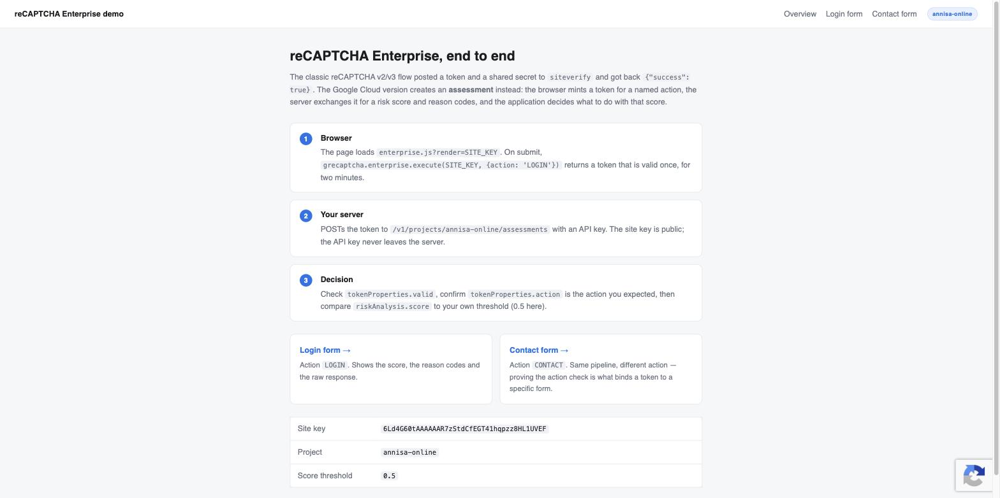
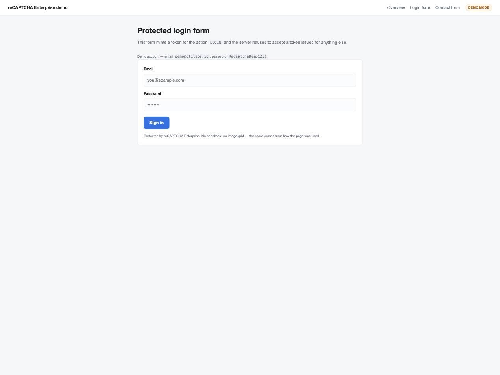
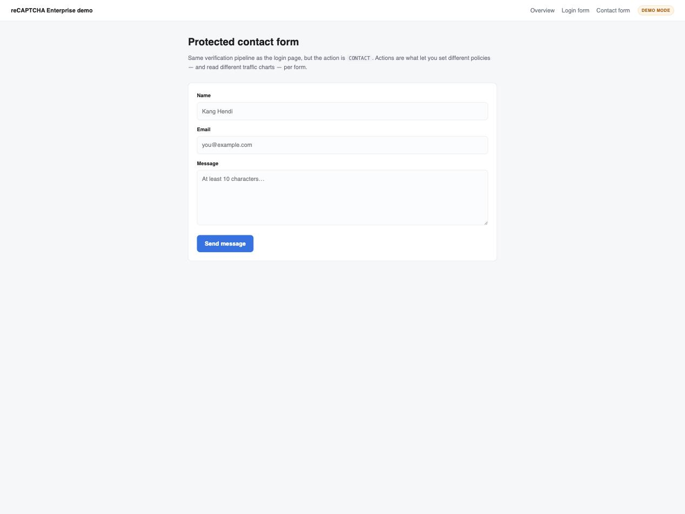

# reCAPTCHA Enterprise demo — Spring Boot

A small Spring Boot 3 / Thymeleaf app that demonstrates the **new reCAPTCHA** (reCAPTCHA
Enterprise, the one managed from the Google Cloud console) end to end: the browser mints a token
for a named action, the server exchanges it for a risk score through the **Assessment API**, and
the app applies its own policy to that score.

Wired for project `annisa-online` and site key `6Ld4G60t…UVEF` — change both in
`src/main/resources/application.yml`.



## Old vs new

| | reCAPTCHA v2 / v3 (classic) | reCAPTCHA Enterprise |
|---|---|---|
| Verify endpoint | `https://www.google.com/recaptcha/api/siteverify` | `https://recaptchaenterprise.googleapis.com/v1/projects/{project}/assessments` |
| Server credential | shared **secret key** | **API key** (or a service account via ADC) |
| Response | `{"success": true, "score": 0.9}` | full assessment: `tokenProperties`, `riskAnalysis.score`, reason codes, account/transaction signals |
| Managed in | google.com/recaptcha admin | Google Cloud console, per project |

The classic secret key still exists on an Enterprise key ("legacy secret key") for third-party
plugins, but the assessment flow is the one this demo uses.

## Run it

Java 21 and Maven 3.9+ required.

```bash
# 1. Demo mode — no credentials, scores are simulated, nothing leaves your machine.
#    Google's script is not even loaded, so the pages work fully offline.
mvn spring-boot:run

# 2. Real assessments
export RECAPTCHA_API_KEY=AIza...        # see below
mvn spring-boot:run
```

Then open <http://localhost:8080>.

The banner in the top-right says `DEMO MODE` when no API key is set, and shows the project id when
it is calling the real API.

## Getting the API key

1. Enable the API on the project:
   `gcloud services enable recaptchaenterprise.googleapis.com --project=annisa-online`
2. Create an API key: **APIs & Services → Credentials → Create credentials → API key**.
3. Restrict it: **API restrictions → Restrict key → reCAPTCHA Enterprise API**. Leave the
   *application* restriction unset (or set an IP restriction) — this key is used server-side, so an
   HTTP-referrer restriction would break it.
4. Add `localhost` to the **domains** list of the site key
   (**Security → reCAPTCHA → your key → Edit key → Domains**), otherwise every token comes back
   with `tokenProperties.valid = false` and a `BROWSER_ERROR` / hostname mismatch.

The site key is public and is rendered into the page. The API key is server-side only. This app
sends it as an `X-Goog-Api-Key` header rather than the `?key=` query parameter shown in the
console's REST snippet — same result, but it cannot end up in a proxy or access log.

## What to look at

| Path | Action | Why |
|---|---|---|
| `/` | — | The three-step flow, and the key/project/threshold in use |
| `/login` | `LOGIN` | Score, reason codes, raw assessment JSON |
| `/contact` | `CONTACT` | Same pipeline, different action |

| Login form | Contact form |
|---|---|
|  |  |

Each submission renders an **Assessment result** panel: the score on a 0.0–1.0 bar with your
threshold marked, whether the action in the token matched the action the server expected, the risk
reason codes, and the pretty-printed API response in a collapsible block.

### Things worth trying

These need a real API key — in demo mode the score is random and the token is ignored.

- Raise `recaptcha.score-threshold` to `0.9` and submit: normal traffic gets blocked, and the
  panel shows exactly how close the score was.
- Change `data-recaptcha-action` on the login form to `CONTACT` (in `login.html`) and submit. The
  score is fine but `actionMatched` is false, so the request is refused. That check is what stops a
  token minted on a harmless page being replayed against your login endpoint.
- Move `grecaptcha.enterprise.execute()` in `fragments/common.html` from the submit handler to page
  load, then wait three minutes before submitting → `EXPIRED`, and resubmitting the same token →
  `DUPE`. That is precisely why this demo mints the token at submit time.
- Submit with an empty `recaptchaToken` (edit it out in devtools) → `MISSING_TOKEN`, short-circuited
  before any API call.

## Code map

```
config/RecaptchaProperties.java   project id, site key, API key, threshold, demo-mode flag
config/RestClientConfig.java      RestClient with sane timeouts
recaptcha/AssessmentRequest.java  request body: event.token / siteKey / expectedAction / IP / UA
recaptcha/AssessmentResponse.java the slice of the response this app reads
recaptcha/AssessmentResult.java   the verdict the controllers act on
recaptcha/RecaptchaService.java   the Assessment API call, action check, threshold policy
web/LoginController.java          action LOGIN
web/ContactController.java        action CONTACT
web/GlobalModelAdvice.java        site key for every template + RecaptchaException handler
templates/fragments/common.html   nav, assessment panel, and the grecaptcha.enterprise script
```

The browser side is nine lines in `fragments/common.html`: any `<form data-recaptcha-action="…">`
gets its submit intercepted, `grecaptcha.enterprise.execute()` mints a token, the hidden
`recaptchaToken` field is filled, and the form is submitted for real.

## Tests

```bash
mvn test
```

`RecaptchaServiceTests` drives the service against a `MockRestServiceServer` — high score allowed,
low score blocked, mismatched action blocked, invalid token reported, missing token short-circuited,
and demo-mode simulation. `RecaptchaDemoApplicationTests` boots the context and renders all three
pages.

## Before production

- **Swap the API key for a service account.** Use `google-cloud-recaptchaenterprise` with
  Application Default Credentials; an API key is fine for a demo but is a bearer credential with no
  identity behind it.
- **Annotate assessments.** `POST …/assessments/{id}:annotate` with `LEGITIMATE` or `FRAUDULENT`
  after you learn the outcome — that feedback is what makes the scores improve for your traffic.
- **Fail open or closed, deliberately.** This demo throws on API failure and shows an error page.
  A login form usually wants to fall back to a second factor rather than lock everyone out during a
  Google outage.
- **Don't treat the score as a boolean.** Two thresholds work better than one: allow above 0.7,
  challenge (MFA, email confirmation) between 0.3 and 0.7, block below.
- **Keep the action names stable** — they are what the reCAPTCHA console charts and what you tune
  thresholds against per form.
